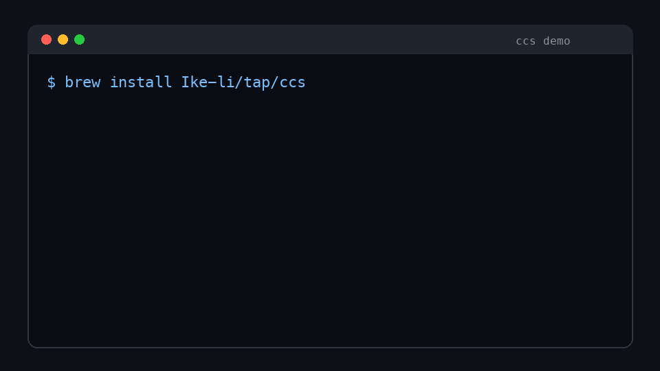

# ccs: Claude Code provider switcher

English | [简体中文](README.zh.md)

[](https://github.com/Ike-li/ccs/actions/workflows/test.yml)
[](https://github.com/Ike-li/ccs/releases)
[](#install)
[](LICENSE)
[](bin/ccs)
[](docs/compare.md)

Switch Claude Code between Anthropic-compatible providers in seconds. No proxy. No daemon. No Node runtime.

`ccs` manages multiple Anthropic-compatible endpoints and writes the active provider into Claude Code's supported `~/.claude/settings.json` env block:

- API key providers use `ANTHROPIC_API_KEY`
- Bearer token providers use `ANTHROPIC_AUTH_TOKEN`

It is useful for Anthropic-compatible endpoints, LiteLLM or internal gateways, OpenRouter, DeepSeek, Kimi, Hugging Face, and similar providers that already speak Claude Code's Anthropic Messages API shape. It is not a protocol translator for OpenAI, Gemini, Ollama, or custom chat APIs.

<sub>Search terms: Claude Code provider switcher, Anthropic-compatible endpoint manager, OpenRouter / DeepSeek / Kimi / LiteLLM setup helper, API key and auth token conflict doctor.</sub>

## Quick Decision

| If you are... | `ccs` helps by... |
|---|---|
| Switching between Claude Code providers | Running `ccs use <name>` instead of hand-editing JSON |
| Setting up DeepSeek, OpenRouter, Kimi, or a gateway | Capturing base URL, auth mode, and model aliases in a reusable provider file |
| Debugging API key vs auth token conflicts | Running `ccs doctor` to find stale settings or shell env state |
| Avoiding local proxies and extra runtimes | Writing official Claude Code settings with POSIX `sh` only |
| Sharing setup steps with a team | Keeping provider layout and commands copyable and reviewable |

## 60-Second Start

Homebrew is the recommended install path:

```bash
brew install Ike-li/tap/ccs
ccs init
ccs preset deepseek --key sk-...
ccs use deepseek
```



Restart the Claude Code session after switching so the new settings are loaded.

If Homebrew is unavailable, the install script is the fallback path. It defaults to a pinned release tag and verifies the downloaded `bin/ccs` sha256. If you override `CCS_INSTALL_REF`, also override `CCS_INSTALL_SHA256`.

```bash
curl -fsSL https://raw.githubusercontent.com/Ike-li/ccs/main/install.sh | sh
```

## Use Cases

- Switch between Anthropic, DeepSeek, OpenRouter, Kimi, Hugging Face, LiteLLM, or an internal Anthropic-compatible gateway.
- Give LiteLLM or gateway users a small Claude Code client setup layer without changing the upstream architecture.
- Put provider recipes in a README, runbook, or onboarding guide.
- Use `ccs doctor` to inspect settings readability, active provider completeness, and shell secret conflicts.
- Keep provider switching auditable without introducing a background daemon or local port.

## Comparison

| Approach | Best for | Main cost | How `ccs` fits |
|---|---|---|---|
| Hand-edit `~/.claude/settings.json` | One-off experiments | Easy to leave stale env values or invalid JSON | Turns switching into a repeatable command |
| `export ANTHROPIC_*` scripts | Temporary shell sessions | Conflicts with settings and disappears across terminals | Writes Claude Code's official settings path and prints cleanup hints |
| Local proxy / router | Protocol translation and routing | Requires a running process, port, and more config | Does not proxy; switches endpoints that already work with Claude Code |
| Secret managers / `.env` tools | Encrypted or team secret workflows | Does not model Claude Code provider semantics | Stays lightweight and can receive keys from those workflows |

More tradeoffs are in [docs/compare.md](docs/compare.md).

## Features

- `ccs set` creates providers interactively or from flags.
- `ccs preset <deepseek|openrouter>` creates common provider recipes.
- `ccs use <name>` writes Claude Code's `settings.json`.
- API key and bearer token modes are mutually exclusive; switching removes the stale managed secret env.
- Provider config lives in `~/.config/ccs/providers/<name>.conf`.
- `ccs ls`, `ccs current`, and `ccs show` inspect provider state.
- `ccs verify [name]` sends one Anthropic Messages probe request.
- `ccs doctor` checks local dependencies, settings, active provider, and shell env conflicts.

## Install

Recommended:

```bash
brew install Ike-li/tap/ccs
```

Fallback installer:

```bash
curl -fsSL https://raw.githubusercontent.com/Ike-li/ccs/main/install.sh | sh
```

The fallback installer is less reviewable than Homebrew. It pins the default install to the latest supported release tag and checks sha256 before installing into `~/.local/bin`.

Local repository install:

```bash
mkdir -p ~/.local/bin
install -m 755 bin/ccs ~/.local/bin/ccs
```

Or run without installing:

```bash
./bin/ccs --help
```

Release and Homebrew tap maintenance are documented in [docs/releasing.md](docs/releasing.md).

### Shell Completion

Bash:

```bash
. /path/to/ccs/completions/ccs.bash
```

zsh:

```bash
mkdir -p ~/.zsh/completions
cp completions/_ccs ~/.zsh/completions/_ccs
# Add to ~/.zshrc:
#   fpath=(~/.zsh/completions $fpath)
#   autoload -Uz compinit && compinit
```

## Usage

Initialize the config directory:

```bash
ccs init
```

Create a provider interactively:

```bash
ccs set deepseek
```

TTY-capable terminals let you choose the secret env with left/right arrows:

```text
Base URL:
Secret env (<-/->, Enter): ANTHROPIC_API_KEY  ANTHROPIC_AUTH_TOKEN
Key for ANTHROPIC_AUTH_TOKEN:
Model (optional):
Opus model (optional):
Sonnet model (optional):
Haiku model (optional):
```

`Model` writes `ANTHROPIC_MODEL`. `Opus model`, `Sonnet model`, and `Haiku model` write the `/model` alias defaults. A single-model provider can use the same value for all aliases; multi-model providers can set each alias separately.

Switch providers:

```bash
ccs use deepseek
```

`ccs use` verifies the provider by default. For local-only switching:

```bash
ccs use deepseek --no-verify
```

If Claude Code reports `Auth conflict: Both a token ... and an API key ... are set`, the current shell usually still exports the opposite secret. `ccs use` prints a cleanup hint:

```bash
unset ANTHROPIC_AUTH_TOKEN
claude
```

For eval-safe cleanup output:

```bash
eval "$(ccs use deepseek --shell)"
```

`--shell` still writes `settings.json`, prints cleanup commands to stdout, and sends ordinary status text to stderr.

### Switching back to your claude.ai subscription

`official` is a built-in pseudo provider. It removes the managed provider env from `settings.json`, so Claude Code falls back to its own claude.ai login (OAuth):

```bash
ccs use official
```

Log in once inside Claude Code with `/login` if you have not already; switching back to a provider is just `ccs use <name>`. If the current shell still exports `ANTHROPIC_API_KEY` or `ANTHROPIC_AUTH_TOKEN`, the export overrides the subscription login — `ccs use official` warns about it, and `eval "$(ccs use official --shell)"` cleans it up.

### Per-project provider pinning

`--project` pins a provider for the current directory by writing the managed env into `./.claude/settings.local.json`. Claude Code merges that file per key on top of your global settings, so the pin wins in this directory and everything else (permissions, hooks, non-managed env) is preserved and inherited:

```bash
ccs use glm --project          # this directory uses glm
ccs use official --project     # this directory uses your claude.ai subscription
ccs use --global               # remove the pin; follow global settings again
```

Safety rails:

- ccs refuses to write a provider secret into a project file that is not git-ignored, and prints the one-line fix.
- Managed keys that the global settings define but the pinned provider does not are written as `""`, so they cannot bleed through the per-key merge (Claude Code treats an empty env value as unset). `ccs use official --project` blanks the auth/url/model core the same way.
- Inside a pinned directory `ccs current` shows both scopes, resolving the pin back to a provider name; `ccs doctor` flags bleed-through keys and gitignore problems.

The global active marker is not touched by project pins, and restarting the Claude Code session is still required for env changes to apply.

### Slimming a copied project file

Project files often start life as a hand copy of the global settings, so most non-env keys are byte-identical duplicates that shadow the global scope forever (a duplicated hook even runs twice). `ccs slim` reports the duplicates; `ccs slim --apply` backs the file up under `~/.config/ccs/backups/` and removes them, after which those keys inherit from the global settings — the effective configuration does not change, and future global edits apply to the project automatically:

```bash
ccs slim            # report duplicated top-level keys
ccs slim --apply    # remove them (backup kept; requires jq)
```

Keys with values that differ from the global file are always kept, and the `env` block is never touched.

## Common Commands

| Command | Purpose |
|---|---|
| `ccs init` | Create `~/.config/ccs` |
| `ccs set [name]` | Create or update a provider interactively |
| `ccs set <name> --base-url URL --key KEY` | Create or update from flags |
| `ccs set <name> --use-auth-token` | Store the secret as `ANTHROPIC_AUTH_TOKEN` |
| `ccs preset deepseek --key KEY` | Create the DeepSeek recipe |
| `ccs preset openrouter --key KEY` | Create the OpenRouter recipe |
| `ccs use <name>` | Switch active provider and verify first |
| `ccs use <name> --no-verify` | Switch without a network request |
| `ccs use official` | Switch back to the claude.ai subscription (clears managed provider env) |
| `ccs use <name> --project` | Pin a provider for the current directory (`./.claude/settings.local.json`) |
| `ccs use official --project` | Pin the claude.ai subscription for the current directory |
| `ccs use --global` | Remove the project pin; the directory follows global settings again |
| `ccs slim [--apply]` | Report/remove project keys that duplicate the global settings |
| `ccs verify [name]` | Verify a provider |
| `ccs doctor` | Diagnose settings, active provider, dependencies, and shell conflicts |
| `ccs ls` | List providers |
| `ccs current` | Show active provider |
| `ccs show <name> [--show-key]` | Show provider details; keys are masked by default |
| `ccs rm <name>` | Remove a provider; active removal clears managed settings env |

Advanced model and env options:

```bash
ccs set <name> --model claude-sonnet-4-6
ccs set <name> --opus-model claude-opus-4-7
ccs set <name> --sonnet-model claude-sonnet-4-6
ccs set <name> --haiku-model claude-haiku-4-5
ccs set <name> --unset-model
ccs set <name> -e ANTHROPIC_DEFAULT_SONNET_MODEL=claude-sonnet-4-6
ccs set <name> -e CLAUDE_CODE_SUBAGENT_MODEL=claude-haiku-4-5
ccs set <name> -e CLAUDE_CODE_EFFORT_LEVEL=max
ccs set <name> --unset-env ANTHROPIC_DEFAULT_SONNET_MODEL
```

`--unset-model` only removes `ANTHROPIC_MODEL`. Use `--unset-env KEY` for Opus/Sonnet/Haiku aliases, Claude Code subagent model, and effort level.

## Scripted Examples

API key provider:

```bash
ccs set anthropic \
  --base-url https://api.anthropic.com \
  --key sk-ant-... \
  --use-api-key
```

Auth token provider:

```bash
ccs set openrouter \
  --base-url https://openrouter.ai/api \
  --key sk-or-v1-... \
  --use-auth-token \
  --opus-model '~anthropic/claude-opus-latest' \
  --sonnet-model '~anthropic/claude-sonnet-latest' \
  --haiku-model '~anthropic/claude-haiku-latest' \
  -e CLAUDE_CODE_SUBAGENT_MODEL='~anthropic/claude-opus-latest'
```

DeepSeek's Claude Code setup uses `ANTHROPIC_AUTH_TOKEN` / Bearer auth. If an older DeepSeek provider was created in API key mode:

```bash
ccs set ds --use-auth-token
ccs use ds
```

More provider recipes are in [docs/providers.md](docs/providers.md).

Avoid shell history by reading the key from stdin:

```bash
printf '%s\n' 'sk-or-v1-...' | ccs set openrouter \
  --base-url https://openrouter.ai/api \
  --key - \
  --use-auth-token
```

## File Layout

```text
~/.config/ccs/
  active
  providers/
    kimi.conf

~/.claude/settings.json
  env:
    ANTHROPIC_BASE_URL:    ...
    ANTHROPIC_API_KEY:     ...  # API key mode
    ANTHROPIC_AUTH_TOKEN:  ...  # auth token mode
    ANTHROPIC_MODEL:       ...  # optional
    ANTHROPIC_DEFAULT_OPUS_MODEL:    ...  # optional, /model opus alias
    ANTHROPIC_DEFAULT_SONNET_MODEL:  ...  # optional, /model sonnet alias
    ANTHROPIC_DEFAULT_HAIKU_MODEL:   ...  # optional, /model haiku alias
    CLAUDE_CODE_SUBAGENT_MODEL:      ...  # optional, subagent model
    CLAUDE_CODE_EFFORT_LEVEL:        ...  # optional, provider-recommended effort level
```

Provider files are plain `KEY=value`:

```text
auth=api_key
key=sk-...
ANTHROPIC_BASE_URL=https://api.example.com/anthropic
ANTHROPIC_MODEL=claude-sonnet-4-6
ANTHROPIC_DEFAULT_OPUS_MODEL=claude-opus-4-7
ANTHROPIC_DEFAULT_SONNET_MODEL=claude-sonnet-4-6
ANTHROPIC_DEFAULT_HAIKU_MODEL=claude-haiku-4-5
CLAUDE_CODE_SUBAGENT_MODEL=claude-haiku-4-5
```

When writing settings, `ccs` removes managed provider env values and the legacy `apiKeyHelper`, writes the active provider, and preserves unrelated top-level fields plus non-managed `env` entries. Before every rewrite the current file is backed up to `~/.config/ccs/backups/` (newest 10 kept). A settings file the parser cannot fully walk (hand-added comments, a BOM, truncation) is refused with `cannot parse` and left untouched. If `jq` is available, settings are reserialized through `jq` for readable nested JSON; if `jq` exists but fails on the file, `ccs` warns before falling back. Without `jq`, the POSIX awk fallback keeps JSON semantics but minifies non-`env` top-level fields.

## Verify

`ccs verify` sends one `max_tokens=1` probe request to `${ANTHROPIC_BASE_URL}/v1/messages` to catch:

- 401 / 403 auth failures
- unsupported or misspelled model names
- unreachable base URLs and timeouts

`CCS_VERIFY_TIMEOUT` changes the timeout in seconds. The default is 10.

The probe model uses `ANTHROPIC_MODEL` first, then `ANTHROPIC_DEFAULT_OPUS_MODEL`, `ANTHROPIC_DEFAULT_SONNET_MODEL`, `ANTHROPIC_DEFAULT_HAIKU_MODEL`, and finally the built-in probe model.

`ccs verify` prints the target URL before sending. If a non-loopback `http://` base URL is used, it warns that the provider secret will cross plain HTTP.

## Doctor

`ccs doctor` is local-only and does not send network requests. It checks:

- `claude` and `curl` availability
- `~/.config/ccs` and provider count
- `~/.claude/settings.json` readability and writability
- active provider presence, key, and base URL
- current shell exports of the opposite secret env
- DeepSeek providers still using API key mode

```bash
ccs doctor
```

Example output:

```text
ccs doctor 0.8.0
ok:   config dir exists: ~/.config/ccs
ok:   providers configured: 1
ok:   claude command found
ok:   curl command found
ok:   settings file exists: ~/.claude/settings.json
ok:   settings file is readable
ok:   settings file is writable
ok:   active provider: deepseek
ok:   active provider key is set: <len=8>
ok:   active provider base URL: https://api.deepseek.com/anthropic
ok:   active provider secret env: ANTHROPIC_AUTH_TOKEN
summary: 0 failure(s), 0 warning(s)
```

## Troubleshooting

| `ccs verify` output | Meaning | Suggested fix |
|---|---|---|
| `Authentication failed (401)` | Provider key is wrong or expired | Check with `ccs show <name> --show-key`; update with `ccs set <name> --key NEW` |
| `Access denied (403)` | Key is valid but denied | Check provider account scope, quota, or IP rules |
| `Provider rejected: <message>` | Provider rejected the request | Read the message; for bad models, set `--model` or individual aliases |
| `Connection failed: ...` | Base URL, DNS, or timeout problem | Test with `curl -v ${BASE_URL}/v1/messages`; adjust `CCS_VERIFY_TIMEOUT` |
| `unsupported scheme: file` | Base URL is not HTTP(S) | Use `ccs set <name> --base-url https://...` |

If Claude Code reports an API key/token conflict, see the provider switching section above and unset the stale secret from the current shell.

## Security Model

- `~/.config/ccs/providers/*.conf` contains plaintext provider keys.
- `~/.claude/settings.json` contains the active provider key/token in plaintext.
- `ccs` creates new sensitive files under `umask 077` and tries to set files to `0600` and config directories to `0700`.
- If chmod fails on a filesystem that cannot enforce owner-only permissions, `ccs` warns on stderr.
- Treat synced or backed-up `settings.json` as a plaintext secret file.

## Maintenance

- Version history: [CHANGELOG.md](CHANGELOG.md)
- Why ccs has this shape (constraints, invariants, rejected designs): [docs/design.md](docs/design.md)
- Comparison with hand-editing settings, shell exports, proxies, and GUI switchers: [docs/compare.md](docs/compare.md)
- Contributing: [CONTRIBUTING.md](CONTRIBUTING.md)
- Security boundary and reporting: [SECURITY.md](SECURITY.md)
- Outreach copy and awesome-list pitch: [docs/outreach.md](docs/outreach.md)

## Uninstall

```bash
rm -f ~/.local/bin/ccs
rm -rf ~/.config/ccs
# Optional: remove managed ANTHROPIC_* env from ~/.claude/settings.json
```

## Exit Codes

| Code | Meaning |
|---|---|
| 0 | Success |
| 1 | User error, verify failure, or invalid input |

## License

GPL-3.0 - see [LICENSE](LICENSE).
