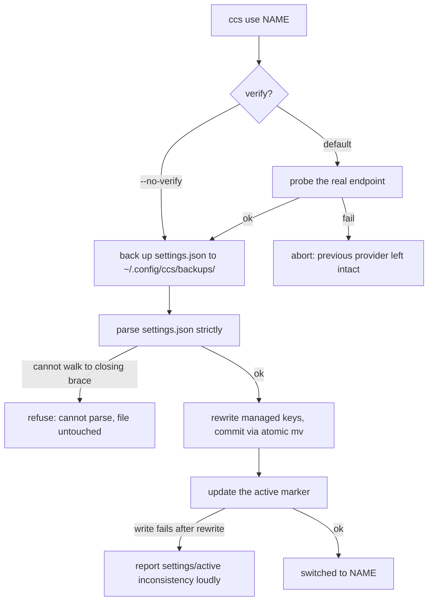

# Design: the problem from first principles

This document explains why ccs has the shape it has. It is the reference for
evaluating feature requests: a request that breaks one of the constraints or
invariants below is out of scope no matter how convenient it would be.

## What the need actually is

Strip the feature language away and the need is physical:

> Claude Code snapshots a set of `ANTHROPIC_*` key/values when a session
> starts. "Switching providers" means editing what the next snapshot will
> read — and guaranteeing the snapshot is never a mix of two providers.

Everything else (verify, doctor, project pins, the `official` pseudo
provider) is derived from making that edit safe, observable, and reversible.

## Constraints inherited from Claude Code

These are facts about Claude Code, not choices ccs made. They were verified
empirically and they dictate the architecture:

1. **Startup snapshot.** Claude Code reads its settings chain and process
   environment once per session. No external tool can retarget a running
   session; the honest contract is "restart to apply". (An earlier ccs
   generation tried to dodge this with a shell wrapper that exported env
   vars; it only affected one shell and was removed.)
2. **Settings precedence.** Process env beats `settings.json`. This is why
   `ccs use`/`doctor` warn when the shell exports `ANTHROPIC_API_KEY` or
   `ANTHROPIC_AUTH_TOKEN`: a stale export silently overrides whatever ccs
   wrote.
3. **Per-key merge across scopes.** Project `settings.local.json` overrides
   the global file *key by key*; absent keys inherit. A project pin
   therefore cannot just write its own keys — every managed key the global
   scope defines but the pinned provider does not must be explicitly
   blanked to `""` (which Claude Code treats as unset) or it bleeds
   through. This single fact shapes the whole `--project` implementation.
4. **`settings.json` is shared ground.** It also holds `permissions`,
   `hooks`, `statusLine`, and anything future Claude Code versions add.
   ccs must edit its managed keys and provably leave the rest alone.

## The design space, and why settings rewriting won

| Approach | Why not |
|----------|---------|
| Shell env wrapper (`ccs() { export ... }`) | Only affects the current shell; every new terminal silently reverts. Tried and removed. |
| Local proxy that routes per request | Adds a resident process and moves the trust boundary into ccs itself; out of scope permanently. |
| Swapping whole `settings.json` files (symlink/copy per provider) | Forks the non-provider settings: an edit to `permissions` in one copy is lost in the others. |
| `apiKeyHelper` | Covers only the credential, not `ANTHROPIC_BASE_URL`/model mappings; ccs removes it from managed settings instead. |
| **Rewrite the managed keys inside `settings.json`** | The only persistent location Claude Code natively reads for all of base URL, secret, and model mapping — while coexisting with config ccs does not own. |

The cost of the winning option is that ccs must read and rewrite JSON
reliably from POSIX sh. That tradeoff — a ~170-line awk JSON scanner — is
the project's main complexity and its main risk surface, which is why the
scanner refuses to rewrite anything it cannot walk end to end, every
rewrite is backed up to `~/.config/ccs/backups/`, and `jq` is preferred
whenever it is installed.

## Invariants

1. **No half-switch.** The managed key set moves as one unit. Order:
   verify (network probe) → write settings → update the active marker. A
   failure at any step leaves the previous provider fully intact; a
   failure after the settings write is reported loudly, never swallowed.
2. **Leave what you do not own.** Non-managed top-level fields and
   non-managed env keys survive every rewrite byte-for-byte in semantics
   (minified at worst). When that cannot be guaranteed — unparseable file —
   ccs refuses instead of guessing, and the pre-rewrite backup bounds the
   damage of any remaining bug.
3. **Fail truthfully.** `ccs use` verifies against the real endpoint by
   default and refuses to claim success it did not observe. `--no-verify`
   is the explicit escape hatch.
4. **Secrets have four leak surfaces, each with a named defense.** Process
   listings (`verify` sends auth via a private curl config file, never
   argv; `--key -` reads from stdin to keep keys out of shell history),
   git (`--project` refuses to write a secret into a file that is not
   git-ignored), file permissions (umask 077, 0600/0700 throughout), and
   the network (plaintext HTTP warning with a loopback exemption).
5. **Atomic commits.** Every file ccs replaces is staged in a temp file on
   the destination filesystem and committed with `mv` (rename, not
   copy+unlink).

## Architecture: the write path

The invariants above compose into one ordered pipeline. Every `ccs use`
runs it top to bottom; a failure at any node leaves the previous
provider fully intact, and the pre-rewrite backup bounds the blast
radius of anything below the rewrite node.

The same contract, read three ways: the order (verify → write → mark)
is Invariant 1, the *refuse* and *atomic mv* nodes are Invariants 2 and
5, and the two loud-failure leaves (`INC`, `AB`) are why a half-switch
is never silently committed.

## Deliberate tradeoffs, kept open

- **The `active` marker is stored, not derived.** `settings.json` is the
  source of truth Claude Code reads; `~/.config/ccs/active` is a second
  copy of that fact and can drift (ccs reports drift loudly rather than
  hiding it). The project-pin side already demonstrates the better model —
  `current`/`doctor` *derive* the pin by matching the file's managed keys
  back to provider configs, with no marker to go stale. Migrating the
  global side to derivation would delete a class of inconsistency; it is
  kept stored for now because the marker also names providers that no
  longer verify (and the migration touches every command).
- **Hand-written awk JSON scanner vs. requiring jq.** A hard jq dependency
  would delete the riskiest code in the project, and the Homebrew path
  could carry it for free (`depends_on "jq"`). The scanner stays because
  the `curl | sh` fallback path promises zero dependencies beyond POSIX
  userland — but jq is always preferred when present, and the scanner's
  failure mode is now "refuse and keep the file", never "guess".

## Out of scope, permanently

- Running a proxy, daemon, or any resident process.
- Editing settings keys ccs does not manage.
- Pretending a switch applies to an already-running session.
- Languages or runtimes beyond POSIX sh + standard userland for the tool
  itself (tests are Python; that dependency never ships to users).
